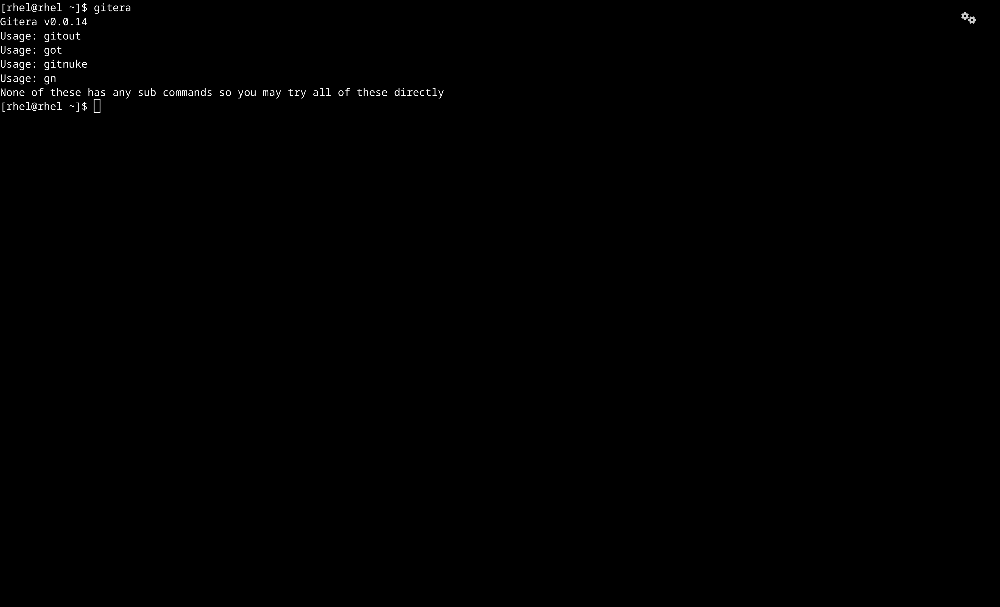
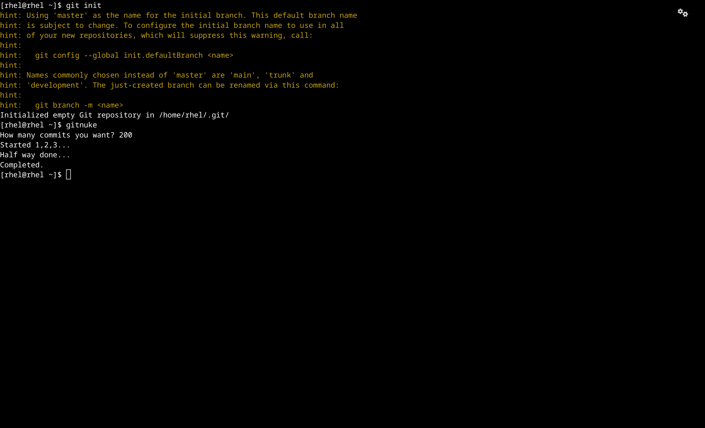

<h1>
  
  Gitera
</h1>

**An umbrella of utility tools for Git VC.**

    pip install gitera
Gitera consists of:
  -  gitera  - The parent command that shows gitera version and how to use other related commands 
  -  gitout  - A CLI tool to walk through all of your commits and checkout with a single click.
  -  gitnuke - Create numerous commits in seconds for experiments and testings. (Not usable yet)

**Supported Platforms :**
| Platforms                 | Support Level / Compatibility | Note
|---------------------------|-------------------------------|------------------------------------------------------------------------------
| BSD                       | 10/10                         | Fully Compatible
| Linux                     | 10/10                         | Fully Compatible
| MacOS                     | ?                             | Install python using brew and use it to install gitera
| Windows                   | 0/10                          | Use WSL
| WSL                       | 8/10                          | Support can be upto 85%

This tool relies on POSIX APIs to function, primarily the POSIX Shell (bin/sh), so all Unix and Unix like operating systems could handle this program.

---

**Commands and its corresponding TUIs**

**Gitera**

This is the parent command that shows version and other commands usage

**Gitout**

This is the one of the iconic command for gitera. Users can run gitout and it will show all commits in a scrollable way and clicking it checks out to it along with quitting checkout to the commit and branch you were in before, so you don't have to do manually instead of doing git log --oneline , copying the hash and git checkout hash

**Gitnuke**

This command commits how much comment the user said to do. If a user gives invalid number it will default to 100 commits starting from 0 as the test no.

